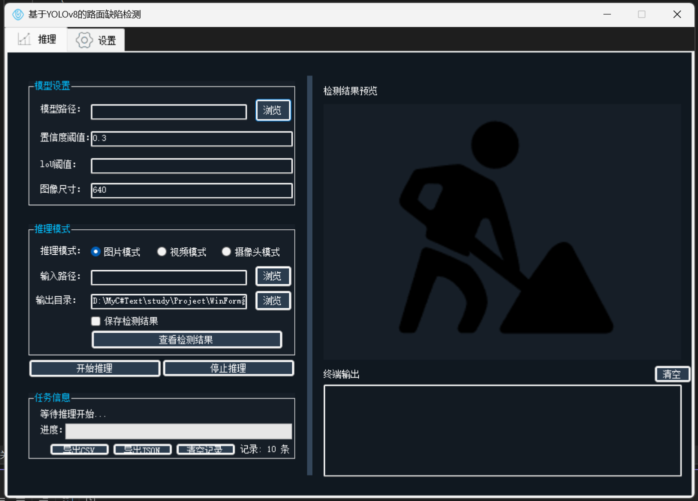
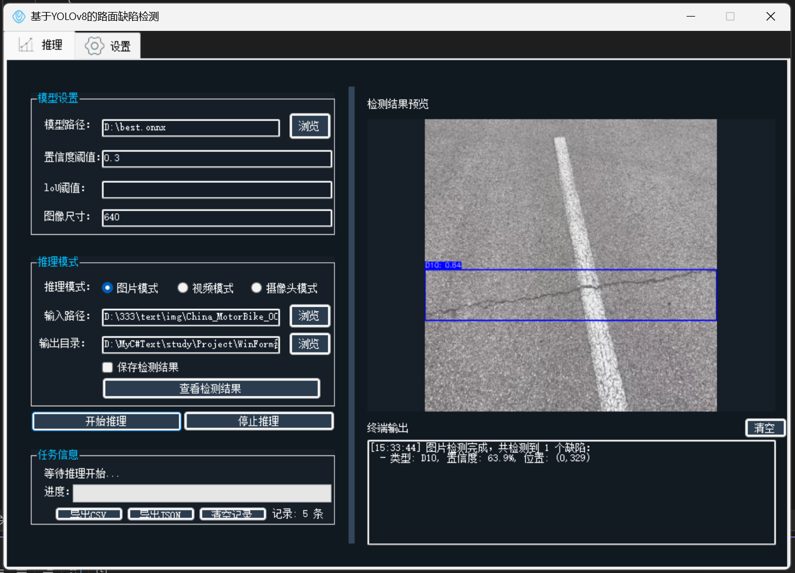

# 基于 YOLOv8 的路面缺陷检测系统

C# WinForms 桌面应用，加载 YOLOv8 ONNX 模型，实现道路裂缝与坑洼的目标检测。

## 项目亮点

- 完整实现 YOLOv8 ONNX 推理流程：预处理 → 推理 → 后处理（置信度过滤 + NMS）
- 支持图片和视频两种检测模式，视频模式支持进度条、关键帧提取、结果视频导出
- SQLite 持久化检测记录，支持 CSV / JSON 格式导出

## 功能

- **图片检测**：加载单张图片，推理并绘制检测框
- **视频检测**：逐帧推理，支持进度条、关键帧提取、结果视频导出
- **检测结果持久化**：SQLite 数据库存储检测记录（缺陷类型、置信度、坐标、时间）
- **数据导出**：支持 CSV / JSON 格式导出检测记录

## 检测类别

| 编号 | 类型 |
|------|------|
| D00 | 纵向裂缝 |
| D10 | 横向裂缝 |
| D20 | 龟裂 |
| D40 | 坑洼/修补 |

## 技术栈

- **框架**：.NET Framework 4.7.2 + WinForms
- **推理引擎**：ONNX Runtime 1.23（CPU）
- **图像处理**：OpenCvSharp4
- **数据库**：SQLite
- **模型格式**：YOLOv8 → ONNX 导出

## 推理流程

```
输入图像 → Resize 640×640 → BGR→RGB + 归一化 → DenseTensor[1,3,640,640]
→ ONNX Runtime 推理 → 输出[1,8,8400] → 置信度过滤(>0.3) → NMS(IoU=0.5) → 绘制检测框
```

## 运行方式

1. 使用 Visual Studio 2022 打开 `.sln` 文件
2. 还原 NuGet 包
3. 准备一个 YOLOv8 导出的 `.onnx` 模型文件（4 类输出）
4. 编译运行，在界面中选择模型文件和输入图片/视频即可

## 界面预览



